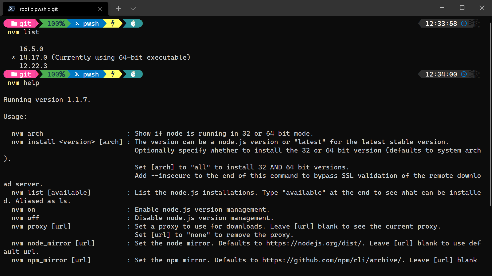

# Mastering SAP OnAir 2021 Master Class: MODERN DEVELOPMENT - TOOLING TO SUPPORT HANA, CAP, FIORI, MOBILE AND ABAP

[Mastering SAP OnAir 2021 Master Class Site](https://masteringsapconference.com/msap/aus/masterclasses/)

This is a broad masterclass session will look at the role of Business Application Studio and VSCode in the modern SAP development space. We will see how to get started with both community tooling and SAP provided tooling in each environment to support HANA, CAP, Fiori, Mobile and even ABAP development.

## Part 1
Getting setup for development in both Business Application Studio and VSCode locally. We will show the basics of getting started in each environment. We will see how to configure development spaces and why they are needed. How to install SAP ecosystem friendly VSCode extensions.  How to setup a test and debug environment in both tools. Basically get a developer setup for all types of modern development in the SAP tools space.

### Getting Started with VSCode

* [Setup for Local JavaScript Development](https://youtu.be/b9vJe2rf4LA)
* Node.js Runtime & NVM (Node Version Manager)
  * [Node.js Releases](https://nodejs.org/en/about/releases/)
  * NVM usage
  
* VSCode Extensions
  * [SAP Fiori Tools - Extension Pack](https://marketplace.visualstudio.com/items?itemName=SAPSE.sap-ux-fiori-tools-extension-pack)
  * [SAP CDS Language Support](https://marketplace.visualstudio.com/items?itemName=SAPSE.vscode-cds)
* NPM - Node Package Manager
* [Tutorial: Set Up Local Development Using VS Code](https://developers.sap.com/tutorials/btp-app-set-up-local-development.html)

### Getting Started with SAP Business Application Studio

* Business Application Studio Dev Spaces
* [Step 1: Create dev space in SAP Business Application Studio](https://developers.sap.com/tutorials/hana-cloud-cap-create-project.html)

## Part 2
Let’s build a Cloud Application Programming Model application. We will use the latest in CAP modeling and development tooling to create a CAP application, add Fiori UI and extend the basic project to include HANA native artifacts and tooling as well.

* [Combine CAP with SAP HANA Cloud to Create Full-Stack Applications](https://developers.sap.com/mission.hana-cloud-cap.html)

## Part 3
But I’m an ABAP developer. Let’s bring the workshop back around to where most of us started – ABAP.  Although ABAP tooling isn’t official offered outside of Eclipse; let’s look at the state of community tooling in VSCode. Also let’s see how CAP, Fiori, and HANA tooling plays alongside the ABAP development experience.

* [ABAP VSCode Extension](https://marketplace.visualstudio.com/items?itemName=larshp.vscode-abap) 
* [ABAP remote filesystem](https://marketplace.visualstudio.com/items?itemName=murbani.vscode-abap-remote-fs)
* [Connecting from SAP Business Application Studio to SAP ABAP Environment in BTP](https://blogs.sap.com/2021/07/23/connecting-from-sap-business-application-studio-to-sap-abap-environment-in-btp/)
  